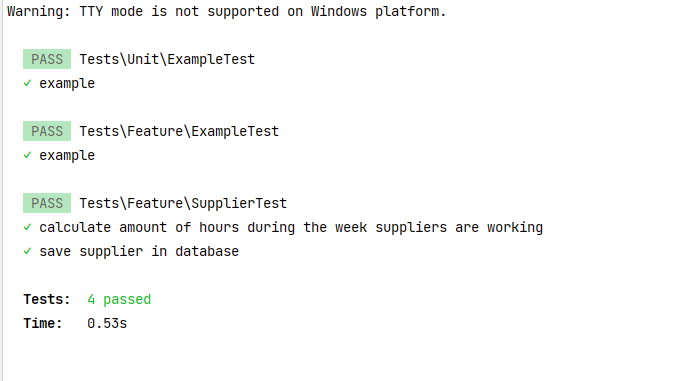

# Interview.

### Unit Tests
I've added some new seeders Suppliers  + SuppliersScheduleSeeder
to run it please execute

> php artisan migrate:fresh && php artisan db:seed
> php artisan test

### Result example:
 

